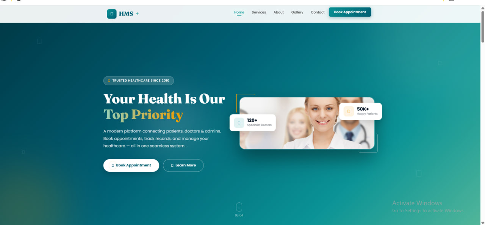
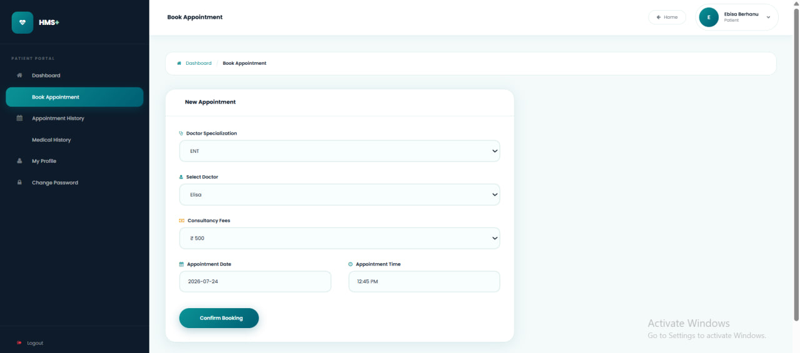
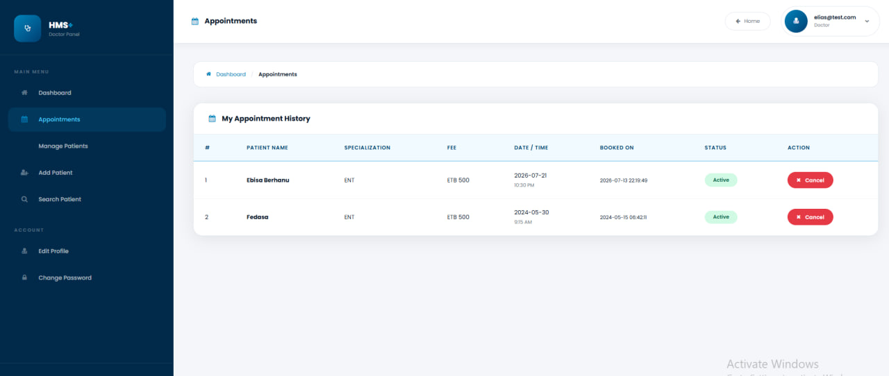

# 🏥 Hospital Management System (HMS+)

A comprehensive web-based Hospital Management System built with PHP and MySQL that connects patients, doctors, and administrators in a seamless healthcare platform.

<div align="center">

[](http://hmsfree.infinityfreeapp.com/)
[](https://www.php.net/)
[](https://www.mysql.com/)
[](LICENSE)

**[🌐 Live Demo](http://hmsfree.infinityfreeapp.com/)** | **[🚀 Quick Start](#installation)** | **[📖 Documentation](#key-features)**

</div>

---

## 📸 Screenshots

### 🏠 Landing Page


### 👤 Patient Portal
<table>
  <tr>
    <td width="50%">
      
      <p align="center"><b>Patient Login</b></p>
    </td>
    <td width="50%">
      
      <p align="center"><b>Patient Dashboard</b></p>
    </td>
  </tr>
  <tr>
    <td width="50%">
      
      <p align="center"><b>Book Appointment</b></p>
    </td>
    <td width="50%">
      
      <p align="center"><b>Medical History</b></p>
    </td>
  </tr>
</table>

### 👨‍⚕️ Doctor Portal
<table>
  <tr>
    <td width="50%">
      
      <p align="center"><b>Doctor Login</b></p>
    </td>
    <td width="50%">
      
      <p align="center"><b>Doctor Dashboard</b></p>
    </td>
  </tr>
</table>

### 👔 Admin Portal
<table>
  <tr>
    <td width="50%">
      
      <p align="center"><b>Admin Login</b></p>
    </td>
    <td width="50%">
      
      <p align="center"><b>Admin Dashboard</b></p>
    </td>
  </tr>
</table>

---

## 🌐 Quick Access Links

<div align="center">

| Portal | URL | Access |
|--------|-----|--------|
| 🏠 **Landing Page** | [Visit](http://hmsfree.infinityfreeapp.com/) | Public |
| 👤 **Patient Portal** | [Login](http://hmsfree.infinityfreeapp.com/hms/user-login.php) | Register/Login |
| 👨‍⚕️ **Doctor Portal** | [Login](http://hmsfree.infinityfreeapp.com/hms/doctor/) | Doctor Account |
| 👔 **Admin Panel** | [Login](http://hmsfree.infinityfreeapp.com/hms/admin/) | admin / Test@12345 |

</div>

---

## ✨ Key Features

### 👤 Patient Portal
- ✅ User registration and secure login
- ✅ Book appointments by doctor specialization
- ✅ View appointment history and status
- ✅ Manage medical records
- ✅ Update profile and change password

### 👨‍⚕️ Doctor Portal
- ✅ View and manage appointments
- ✅ Approve/cancel appointments
- ✅ Add patient medical records
- ✅ Search and view patient information
- ✅ Dashboard with statistics

### 👔 Admin Portal
- ✅ Manage doctors and specializations
- ✅ View all patients and appointments
- ✅ System statistics dashboard
- ✅ User activity logs
- ✅ Manage contact submissions
- ✅ Update About Us and Contact pages

---

## 🛠️ Technology Stack

- **Frontend:** HTML5, CSS3, Bootstrap 4, JavaScript, jQuery
- **Backend:** PHP 7.4+
- **Database:** MySQL 5.7+
- **Icons:** Font Awesome
- **Fonts:** Google Fonts (Fraunces, Poppins)

---

## 💻 System Requirements

- **Web Server:** Apache 2.4+ / Nginx
- **PHP:** 7.4 or higher (compatible with PHP 8.x)
- **MySQL:** 5.7+ / MariaDB 10.3+
- **Browser:** Chrome, Firefox, Safari, Edge (latest versions)

---

## 📦 Installation

### Local Installation (XAMPP)

#### 1. Install XAMPP
Download and install from [https://www.apachefriends.org/](https://www.apachefriends.org/)

#### 2. Clone Repository
```bash
git clone https://github.com/yourusername/HMS-Plus.git
cd HMS-Plus
```

Move `hospital` folder contents to:
```
C:\xampp\htdocs\HMS\
```

#### 3. Create Database
1. Start Apache and MySQL in XAMPP
2. Open phpMyAdmin: `http://localhost/phpmyadmin`
3. Create database: `hms`
4. Import: `SQL File/hms.sql`

#### 4. Configure Database
The system auto-detects localhost. Verify in `hospital/hms/include/config.php`:
```php
// Localhost settings
DB_SERVER: 'localhost'
DB_USER: 'root'
DB_PASS: ''
DB_NAME: 'hms'
```

#### 5. Access Application
- **Landing Page:** `http://localhost/HMS/`
- **Patient Login:** `http://localhost/HMS/hms/user-login.php`
- **Doctor Login:** `http://localhost/HMS/hms/doctor/`
- **Admin Login:** `http://localhost/HMS/hms/admin/`

---

### Production Deployment

#### 1. Update Configuration
Edit `hospital/hms/include/config.php` with your production database credentials:
```php
define('DB_SERVER','your_mysql_host');
define('DB_USER','your_mysql_user');
define('DB_PASS','your_mysql_password');
define('DB_NAME','your_database_name');
```

#### 2. Upload Files
Upload via FTP to your web host's public directory (usually `/htdocs/` or `/public_html/`):
```
/htdocs/
├── assets/
├── hms/
└── index.php
```

#### 3. Import Database
Use phpMyAdmin on your hosting to import `SQL File/hms.sql`

---

## 🔑 Default Login Credentials

### Admin
```
Username: admin
Password: Test@12345
```

### Patient
Register a new account at: `http://yoursite.com/hms/registration.php`

### Doctor
Check database `doctors` table for credentials or add via Admin panel.

⚠️ **Important:** Change admin password immediately after installation!

---

## 📁 Project Structure

```
HMS/
├── hospital/
│   ├── assets/              # Landing page assets
│   ├── hms/                 # Main application
│   │   ├── admin/          # Admin portal
│   │   ├── doctor/         # Doctor portal
│   │   ├── include/        # Config & shared files
│   │   ├── vendor/         # Third-party libraries
│   │   └── *.php           # Patient portal files
│   └── index.php           # Landing page
└── SQL File/
    └── hms.sql             # Database dump
```

---

## 🐛 Common Issues

### Database Connection Failed
- Verify MySQL is running
- Check credentials in `config.php`
- Ensure database exists and is imported

### Login Not Working
- Clear browser cache
- Verify database tables are populated
- Check admin credentials

### CSS/Images Not Loading
- Clear browser cache (Ctrl+F5)
- Verify file paths are correct
- Check file permissions (755 for folders, 644 for files)

### Blank Page / 500 Error
Enable error reporting in PHP:
```php
error_reporting(E_ALL);
ini_set('display_errors', 1);
```

---

## 🔒 Security Recommendations

1. **Change default passwords** immediately
2. **Use HTTPS** in production
3. **Update password hashing** from MD5 to bcrypt
4. **Use prepared statements** instead of `mysqli_real_escape_string`
5. **Implement CSRF protection** on forms
6. **Keep PHP and MySQL updated**
7. **Regular database backups**

---

## 🚀 Future Enhancements

- [ ] Email/SMS notifications
- [ ] Online payment integration
- [ ] Video consultation
- [ ] Prescription PDF generation
- [ ] Lab report uploads
- [ ] Multi-language support
- [ ] Dark mode
- [ ] Mobile app

---

## 🤝 Contributing

Contributions are welcome! To contribute:

1. Fork the repository
2. Create a feature branch: `git checkout -b feature/new-feature`
3. Commit changes: `git commit -m 'Add new feature'`
4. Push to branch: `git push origin feature/new-feature`
5. Open a Pull Request

---

## 📄 License

This project is licensed under the MIT License - see the [LICENSE](LICENSE) file for details.

---

## 💬 Support

- 🐛 **Issues:** [GitHub Issues](https://github.com/yourusername/HMS-Plus/issues)
- 📧 **Email:** support@hmsplus.com
- 🌐 **Live Demo:** [http://hmsfree.infinityfreeapp.com/](http://hmsfree.infinityfreeapp.com/)

---

## 🙏 Acknowledgments

- Bootstrap Team for responsive framework
- Font Awesome for icon library
- jQuery for JavaScript simplification
- All contributors and testers

---

<div align="center">

### ⭐ Star this repository if you find it helpful!
By Ebisa Berhanu

**[🌐 Live Demo](http://hmsfree.infinityfreeapp.com/)** • **[GitHub](https://github.com/yourusername/HMS-Plus)**

2023

</div>
